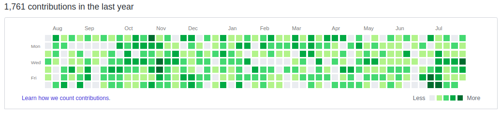

<h1 align="center">Hi 👋, I'm Lavanya Srinivas</h1>
<h3 align="center">Java Developer Fresher | Software Developer | DevOps Enthusiast</h3>

---

### 👩‍💻 About Me

- 🎓 MCA Graduate
- 💻 Interested in Java Development and DevOps
- 🌱 Currently learning Docker, Kubernetes, and Linux
- 🔍 Looking for fresher opportunities in Java / Software Development
- 🚀 Passionate about learning new technologies

---

### 🛠️ Tech Stack

  
  
  
  
  
  
  
  
  
  

---

### 📌 Projects

- **Portfolio Website**  
  Personal portfolio website built using HTML, CSS, and JavaScript.  
  🔗 https://lavanyachakkilam-57.github.io/

- **Java Projects**  
  Basic Java programs and practice projects.

- **DevOps Practice**  
  Hands-on practice with Git, GitHub, Docker, Kubernetes, and Linux.

---

### 📊 GitHub Stats

  

  

---

### 🌐 Connect With Me

  

  

---

### ✨ Quote

"Learning never stops. Every day is a new opportunity to improve."
<h2>GitHub Contributions</h2>

  

---
